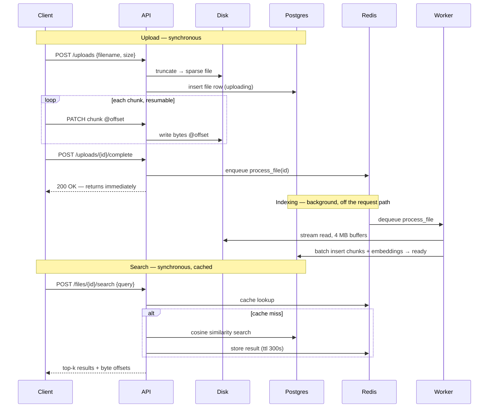

# Large File Processing & Search

Upload large text files (up to 10 GB) with resumable, chunked uploads. Files are
indexed asynchronously in the background and become searchable via natural-language
(embedding-based) semantic search, all while the service stays within a 4 GB RAM
budget.

## Architecture


- **api**: FastAPI app. Handles upload sessions, chunked/resumable writes, status
  queries, search, and section retrieval. Never does CPU-heavy work itself.
- **worker**: a separate `arq` process. Picks up `process_file` jobs from Redis,
  streams the uploaded file off disk, chunks + embeds it, and writes vectors to
  Postgres incrementally.
- **Postgres + pgvector**: stores file/upload metadata and chunk embeddings in one
  database — no separate vector DB service to run.
- **Redis**: doubles as the `arq` task queue and as a cache for search results and
  section reads.

## Running it

```bash
cp .env.example .env
docker compose up --build
```

This starts Postgres (with the `vector` extension), Redis, runs Alembic migrations
(`migrate` service), then starts the `api` (port 8000) and `worker` containers. The
API and worker share a Docker volume for uploaded file storage.

Interactive API docs: `http://localhost:8000/docs`

### Request flow

The diagram above shows *who talks to whom*; this shows *what actually happens,
in order* — from creating an upload through to a cached search result.



Note the request boundary at `200 OK — returns immediately`: the client is
released the instant the indexing job is on the queue, before any indexing has
happened. Everything in the "Indexing" phase runs independently, in the `worker`
process, off that request entirely.

### Typical flow

```bash
# 1. Create an upload session
curl -X POST localhost:8000/uploads \
  -H 'Content-Type: application/json' \
  -d '{"filename": "logs.txt", "total_size": 123456}'
# -> {"file_id": "...", "upload_url": "/uploads/<id>"}

# 2. Upload in chunks (resumable) — each PATCH carries the byte offset it starts at
curl -X PATCH localhost:8000/uploads/<id> \
  -H 'X-Upload-Offset: 0' --data-binary @chunk0

# If interrupted, check how many bytes the server actually has and resume from there
curl localhost:8000/uploads/<id>

# 3. Mark the upload complete — this enqueues background indexing and returns immediately
curl -X POST localhost:8000/uploads/<id>/complete

# 4. Poll status until "ready"
curl localhost:8000/files/<id>

# 5. Search
curl -X POST localhost:8000/files/<id>/search \
  -H 'Content-Type: application/json' \
  -d '{"query": "database connectivity problems", "top_k": 5}'

# 6. Fetch the raw section around a hit
curl "localhost:8000/files/<id>/sections?start=1000&end=1500"
```


## Design discussion

### 1. How a 10 GB file is handled on a 4 GB RAM machine

Nothing in the pipeline ever holds the whole file, or the whole decoded text, in
memory:

- **Upload**: chunks are streamed straight from the HTTP request body to a
  pre-allocated (sparse) file on disk via `request.stream()`, written at their
  target offset. The request handler's memory footprint is one chunk (tens of MB),
  not the file.
- **Indexing**: [`services/storage.iter_file_bytes`](app/services/storage.py) reads
  the file in fixed-size buffers (default 4 MB, configurable). Those bytes are fed
  through an **incremental UTF-8 decoder** (`services/chunker.chunk_byte_stream`)
  that correctly handles multi-byte characters split across buffer boundaries,
  producing overlapping text windows with byte-accurate offsets — without ever
  materializing more than one buffer + one window's worth of text.
- **Embedding + writes**: chunks are embedded and flushed to Postgres in small
  batches (64 chunks per DB round trip; see `worker.DB_FLUSH_BATCH_SIZE`), so the
  resident set stays roughly constant regardless of file size — a 10 GB file and a
  10 MB file use the same peak memory during indexing, just for different amounts
  of time.
- The embedding model itself (`all-MiniLM-L6-v2`, ~90 MB) is small and CPU-only,
  loaded once per process.

### 2. Interrupted uploads

Uploads use a chunked, offset-addressed protocol (similar in spirit to the `tus`
resumable upload protocol):

- `POST /uploads` creates a session and sparse-allocates the destination file
  (`truncate` to `total_size` — a metadata-only operation, no data written).
- Each `PATCH /uploads/{id}` chunk carries an `X-Upload-Offset` header. The server
  compares it against `bytes_received` in Postgres. A match writes the chunk at that
  offset and advances `bytes_received`; a mismatch returns `409` with the server's
  actual `expected_offset`.
- If the connection drops mid-chunk, the client just calls `GET /uploads/{id}` to
  learn how many bytes the server actually has, seeks its local read of the source
  file to that offset, and resumes — no re-upload of already-received bytes, no
  buffering of the whole file on the client either.
- Writes are offset-addressed (`seek` + `write`), so out-of-order or retried chunks
  are safe as long as they target their correct offset.

### 3. Supporting multiple concurrent uploads

Each upload is its own row (`FileRecord`, UUID-keyed) and its own file on disk —
there's no shared mutable state between uploads, so they don't contend with each
other. Concurrency is bounded in two places:

- Per-chunk request size is capped (`UPLOAD_CHUNK_MAX_BYTES`, default 16 MB) so
  one slow/huge client request can't monopolize a worker thread or memory for
  long.
- On the indexing side, the `arq` worker's `max_jobs` setting caps how many
  `process_file` jobs run concurrently *in one worker process* (set to 2 here,
  since each job's steady-state memory is small but non-zero); horizontal scaling
  is just running more worker containers, since jobs are independent and
  coordinate only through Postgres/Redis.

### 4. Processing and indexing a large file efficiently

Indexing is a single streaming pass: read → incrementally decode → window into
overlapping ~1000-character chunks (150-char overlap, so a sentence spanning a
chunk boundary isn't lost) → batch-embed (32 chunks/batch) → batch-insert into
Postgres with progress (`chunks_indexed`) committed as it goes. If the process
crashes partway, `status` reflects `failed` with the error captured, and — because
progress is durable — a straightforward extension is to resume from the last
committed `chunk_index` rather than reprocessing the whole file (not implemented,
noted as a next step for scale).

pgvector's HNSW index (`hnsw ... vector_cosine_ops`) gives approximate
nearest-neighbor search that scales sub-linearly with chunk count, rather than a
full sequential scan per query. (An earlier version used `ivfflat` instead —
switched to HNSW after live testing at ~6k chunks surfaced a real correctness
issue: `ivfflat`'s clusters are trained on whatever rows exist at index-creation
time, and the original migration created the index before any data existed,
producing degenerate clusters that caused genuine matches to occasionally return
zero results. HNSW is built incrementally, so it doesn't have that failure mode.
See `alembic/versions/0002_hnsw_index.py`.)

### 5. How semantic search works

- Each indexed chunk's text is embedded with `all-MiniLM-L6-v2` (384-dim sentence
  embeddings) and stored in a pgvector `vector(384)` column alongside its byte
  offsets.
- A search query is embedded with the same model, then compared against a file's
  chunks using cosine distance (`embedding <=> query_embedding` via pgvector),
  returning the closest `top_k` chunks. This is why *"database connectivity
  problems"* matches *"Connection to database failed after 30 seconds"* — the
  match is on meaning (embedding proximity), not shared keywords.
- Each result carries its chunk's byte range, so the caller can fetch the exact
  original text via `/files/{id}/sections?start=&end=` — useful when you want more
  surrounding context than the indexed chunk alone.

### 6. Scaling to thousands of concurrent uploads and searches

What's here is intentionally sized for the stated constraints (single 4 GB
machine, one Postgres, one Redis). At real scale, the changes I'd make:

- **Storage**: move raw file storage off local disk to object storage (S3-compatible),
  using multipart upload semantics directly (the current resumable protocol maps
  almost 1:1 onto S3 multipart parts) instead of a shared Docker volume.
- **Queue**: replace `arq`/Redis with a durable broker built for this scale
  (SQS, Kafka, or Pub/Sub) with dead-letter handling and per-job retry/backoff,
  and horizontally scale worker consumers independently of the API.
- **Vector search**: pgvector on a single Postgres instance is fine up to some
  millions of vectors; beyond that, move to a purpose-built vector DB (Qdrant,
  Milvus, or a managed service) that shards and scales independently, or partition
  Postgres by file/tenant.
- **Metadata DB**: read replicas / connection pooling (PgBouncer) for the metadata
  store, since status polling from thousands of clients is read-heavy.
- **API layer**: horizontal scaling behind a load balancer (the API is already
  stateless — all state lives in Postgres/Redis/object storage), rate limiting and
  backpressure on uploads, and a CDN/pre-signed URLs so large file bytes don't
  transit the API process at all.
- **Caching**: the current per-file Redis cache would move to a shared cluster
  (Redis Cluster / a managed cache) with eviction tuned for the larger working set.

## Use of AI coding tools

I specified the architecture — streaming pipeline bounded by fixed-size buffers,
offset-addressed resumable uploads, pgvector rather than a separate vector
service, Redis doing double duty as both task queue and cache — and used
**Claude Code** (Anthropic) to implement it, then validated everything against
the actual running Docker stack rather than trusting a read-through: real
uploads via curl and a small browser demo page, real Postgres/Redis inspection
via `psql`/`redis-cli`, real `EXPLAIN ANALYZE` when something looked wrong.

The clearest example: a search for a log line I could see was in the file came
back with zero results once the file had real data (~6k chunks) loaded. Empty
results with no error meant the query itself was the suspect, not the embedding
model — so I compared the raw SQL directly in `psql`, which worked fine, then
ran the same query with the actual query embedding and got zero rows via
`EXPLAIN ANALYZE`, which pointed at the vector index rather than the query
logic. That led to the real cause: `pgvector`'s `ivfflat` index was created in
the same migration as the table, meaning its clusters were trained (k-means) on
zero rows — every row inserted afterward landed in degenerate clusters, so an
approximate search would sometimes probe the wrong one and miss real matches
entirely. Fixed by switching to `hnsw`, which builds incrementally instead of
requiring pre-existing data (`alembic/versions/0002_hnsw_index.py`).

A few other runtime-only failures came up the same way — a SQLAlchemy enum
sending the wrong string to Postgres's native enum type, a response schema
field that couldn't auto-populate from a differently-named ORM attribute, an
async lazy-load on a server-computed column after `commit()` — each one only
visible by actually calling the endpoint, not from reading the code, and each
root-caused against real system state before being fixed.

